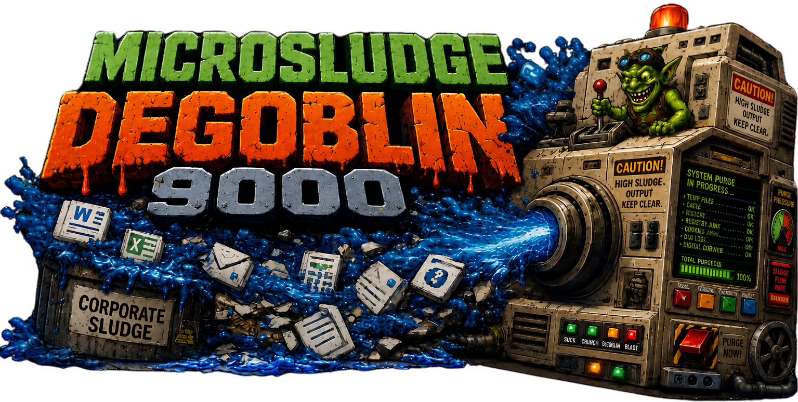

# Microsludge Degoblin

Current version: `1.0.0` (see `VERSION`).

Microsludge Degoblin is a Windows cleanup tool for Microsoft components that keep coming back after updates.

The main trick is the scheduled task. Most cleanup tools run once. Microsludge Degoblin can also install a small post-update watcher that re-applies your selected cleanup after Windows Update activity, because that is when the goblins usually crawl back out.

It targets things like Copilot, OneDrive startup entries, new Outlook, Edge background behavior, widgets, ads, suggestions, and optional Windows AI policies. It can run once, do a dry run first, or install the scheduled task to keep those choices from quietly regressing after update cycles.

It has both a PowerShell console walkthrough and a GUI with guided setup, so users do not have to memorize which switches do what.

## What Makes It Different

Microsludge Degoblin is not trying to be the biggest all-purpose Windows cleaner. It is built around one annoying pattern: Windows Update can bring back apps, settings, startup entries, and policy defaults you already turned off.

The scheduled task is the keep-watch feature. When installed, the package copies itself to:

```text
C:\ProgramData\Microsludge-Degoblin
```

Then Windows Task Scheduler runs it shortly after logon. By default, it only applies cleanup when Windows Update evidence is found. If you choose `-AlwaysApply`, it applies your selected cleanup at every logon instead.

That means you can clean the machine once, then let Microsludge Degoblin keep the beast at bay after update cycles instead of manually rerunning the tool every time Microsoft gets ideas.

## What Do I Click?

- `START-HERE-Microsludge-Degoblin.vbs`: double-click this to open the normal app.
- `START-HERE.txt`: tiny plain-English launch note.
- `WALKTHROUGH.txt`: longer plain-English walkthrough.
- `Scripts\`: the PowerShell engine room for debugging and manual commands.
- `Assets\`: pictures used by the GUI and README.

## System Requirements

- Windows 10 or Windows 11
- Windows PowerShell 5.1
- Administrator approval for detection reports, dry run, apply, task install, and task removal
- Task Scheduler enabled for the post-update automatic cleanup task
- Free space in `C:\ProgramData` for the installed copy and logs
- System Protection enabled if you want Windows restore point creation to succeed

## Default Targets

- Copilot Appx packages and provisioned packages
- Copilot off policies for current user and machine
- OneDrive running process and startup resurrection entries
- Microsoft.OutlookForWindows app/provisioned package
- Microsoft.Edge.GameAssist app/provisioned package
- Edge browser background mode, startup boost, first-run, and sidebar policies
- Microsoft consumer content, ads, suggestions, tailored experiences, activity upload
- Widgets/news taskbar policy and user setting
- SoftLanding, creative, and deferral scheduled tasks

## Default Non-Targets

- Does not move user folders or change shell-folder mappings
- Does not disable third-party startup items
- Does not remove Edge browser itself
- Does not remove or block WebView2
- Does not touch unrelated system components, device drivers, security tools, sync tools, or vendor utilities
- Does not uninstall OneDrive unless `-RemoveOneDrive` is explicitly passed
- Does not disable Edge update services/tasks unless `-DisableEdgeUpdates` is explicitly passed

## Usage

Admin is required for detection reports, dry run, apply, the console wizard, and scheduled-task install. The GUI can open normally and relaunch itself elevated; console paths stop if they are not elevated.

Graphical launcher:

Double-click:

```text
START-HERE-Microsludge-Degoblin.vbs
```

From PowerShell:

```powershell
.\START-HERE-Microsludge-Degoblin.vbs
```

That launcher starts the GUI without leaving a PowerShell console window open. The `Scripts` folder is the engine room; most users do not need to open it.

PowerShell launch, useful for debugging:

```powershell
powershell -ExecutionPolicy Bypass -File .\Scripts\Start-Microsludge-Degoblin-GUI.ps1
```

The GUI includes guided setup, Windows AI detection, dry run, apply, scheduled-task install/removal, and log access. Apply paths offer to create a Windows restore point first.

Restore point creation uses Windows System Protection. If System Protection is off or Windows recently created a restore point, Windows may refuse the request. The GUI and console walkthrough warn you and ask whether to continue. Direct script runs and scheduled-task runs attempt a restore point without prompting and continue if Windows refuses.

Guided console wizard:

```powershell
powershell -ExecutionPolicy Bypass -File .\Scripts\Start-Microsludge-Degoblin-Walkthrough.ps1 -Wizard
```

Quick console menu:

```powershell
powershell -ExecutionPolicy Bypass -File .\Scripts\Start-Microsludge-Degoblin-Walkthrough.ps1
```

Dry run first:

```powershell
powershell -ExecutionPolicy Bypass -File .\Scripts\Microsludge-Degoblin.ps1
```

Apply default cleanup:

```powershell
powershell -ExecutionPolicy Bypass -File .\Scripts\Microsludge-Degoblin.ps1 -Apply
```

Apply stronger cleanup:

```powershell
powershell -ExecutionPolicy Bypass -File .\Scripts\Microsludge-Degoblin.ps1 -Apply -BlockOneDrive -DisableEdgeUpdates
```

Uninstall OneDrive too:

```powershell
powershell -ExecutionPolicy Bypass -File .\Scripts\Microsludge-Degoblin.ps1 -Apply -RemoveOneDrive
```

## Windows AI Detection

Detection-only command:

```powershell
powershell -ExecutionPolicy Bypass -File .\Scripts\Test-Microsludge-WindowsAI.ps1
```

This reports:

- WindowsAI policy registry paths
- Recall, Click to Do, Settings AI agent, and Paint AI policy values
- Recall optional feature state, when queryable
- Related Appx packages
- Related running processes

It does not change registry values, packages, features, services, tasks, or processes.

In wizard mode, this report runs as a preflight. The wizard only asks about Windows AI cleanup when the report finds related targets.

## Switches

Skip switches:

- `-SkipCopilot`
- `-SkipOneDrive`
- `-SkipEdge`
- `-SkipOutlook`
- `-SkipConsumerContent`

Optional stronger switches:

- `-AlwaysApply`: Scheduled-task installer/wrapper option. Runs cleanup at every scheduled logon launch instead of only when Windows Update evidence is found.
- `-BlockOneDrive`: Sets the Windows policy that blocks OneDrive file sync.
- `-RemoveOneDrive`: Runs `OneDriveSetup.exe /uninstall` when a local OneDrive installer is found.
- `-DisableEdgeUpdates`: Disables MicrosoftEdgeUpdate scheduled tasks and `edgeupdate` / `edgeupdatem` services. This can also affect WebView2 update freshness, so it is opt-in.
- `-DisableWindowsAI`: Applies Windows AI policies for Recall availability/snapshots, Click to Do, Settings AI agent, and Paint AI features. This does not remove the Recall optional feature bits.
- `-SkipRestorePoint`: Advanced option for direct apply runs. Skips the automatic restore point request. The GUI and console walkthrough use this after handling the restore point prompt themselves.

## Scheduled Task

This is the main reason to install the tool instead of only running it once. The scheduled task is there to catch Windows Update regressions and re-apply the cleanup choices you selected.

Installing the scheduled task copies the runnable package to:

```text
C:\ProgramData\Microsludge-Degoblin
```

The task runs from that installed copy, so the downloaded package folder can be moved or deleted after task install. Running the installer again refreshes the installed copy while preserving installed logs. Running the uninstaller removes both the scheduled task and the installed package copy.

Task install also adds:

- A Start Menu folder: `Microsludge Degoblin 9000`
- A Windows Installed Apps / Add or Remove Programs entry
- An uninstall launcher that removes the task, app entry, Start Menu shortcuts, and installed copy

Install the Windows Update-aware scheduled task:

```powershell
powershell -ExecutionPolicy Bypass -File .\Scripts\Install-Microsludge-DegoblinTask.ps1
```

Install an every-logon scheduled task:

```powershell
powershell -ExecutionPolicy Bypass -File .\Scripts\Install-Microsludge-DegoblinTask.ps1 -AlwaysApply
```

Install it with stronger options:

```powershell
powershell -ExecutionPolicy Bypass -File .\Scripts\Install-Microsludge-DegoblinTask.ps1 -BlockOneDrive -DisableEdgeUpdates
```

Remove the scheduled task:

```powershell
powershell -ExecutionPolicy Bypass -File .\Scripts\Uninstall-Microsludge-DegoblinTask.ps1
```

You can also uninstall from Windows Settings under Installed Apps / Add or Remove Programs.

By default, the task runs at logon, waits two minutes, and only applies cleanup when Windows Update evidence is found. Evidence can come from restart/update event logs or the Windows Update pending-reboot registry key. With `-AlwaysApply`, it skips that evidence gate.

## Logs

Manual GUI and console runs write logs to `.\Logs` in whichever package copy launched the script.

Installed scheduled-task runs write logs to:

```text
C:\ProgramData\Microsludge-Degoblin\Logs
```

Apply runs and automated wrapper runs prune old logs, keeping the 20 most recent logs and removing logs older than 90 days.

## Assets

GUI and README art is stored in `.\Assets`.

## Walkthrough

See `.\WALKTHROUGH.txt`.

## Versioning

The package version lives in `VERSION` and uses `major.minor.patch` numbering. Scripts log the version at startup, and the scheduled-task installer writes the installed version into the task description.

## Feed the Goblin

Microsludge Degoblin is free and open-source. If it saved you time or spared you a Windows-induced eye twitch, you can feed the goblin. Tips are appreciated, never required, and do not turn this into a support contract.

[Feed the goblin through GitHub Sponsors](https://github.com/sponsors/kvvpa).

## License

MIT License. See `.\LICENSE`.
